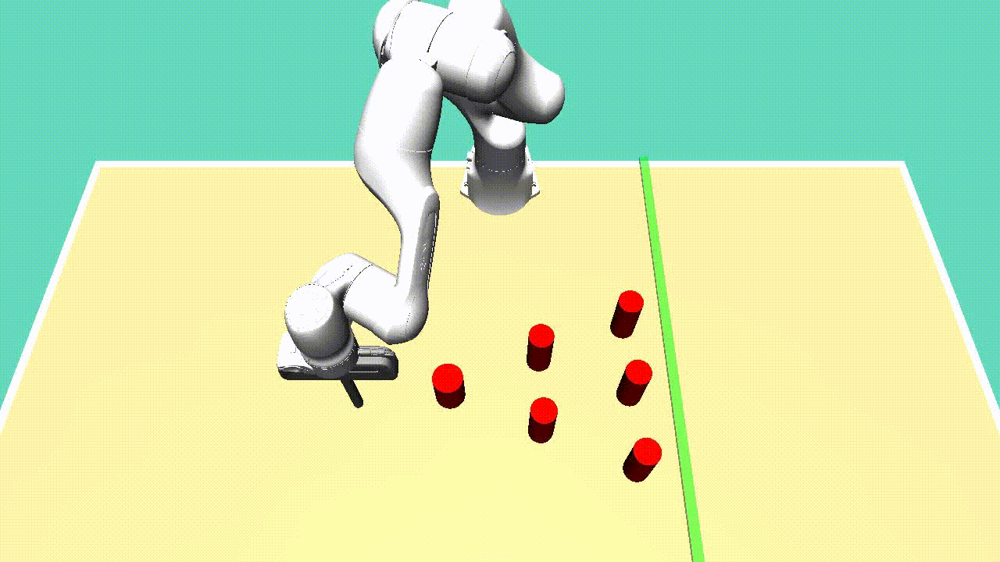
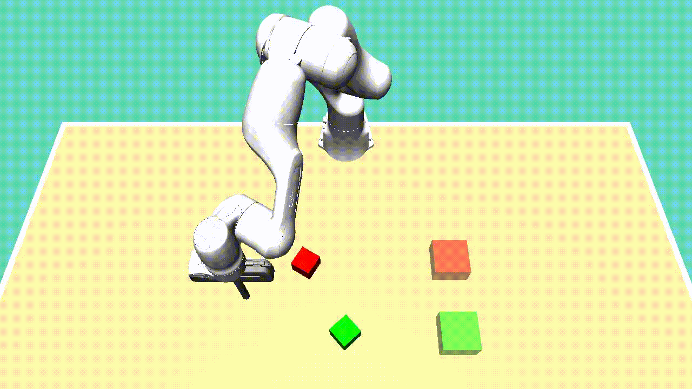
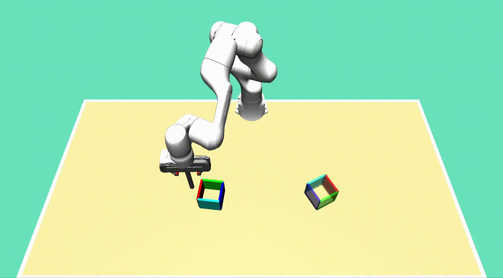

# D3IL_Benchmark
This project provides the code of D3IL Benchmark. D3IL includes 7 robot learning 
tasks, Avoiding, Pushing, Aligning, Sorting, Stacking, Inserting and Arranging. 
All those environments are implemented based mujoco and gym. The [D3IL](environments/d3il) 
contains the robot controller as well as the environments implementation. The 
[Agents](agents) provides 11 imitation learning methods including both state-based and 
image-based policies.

<p align="center">
  
  
  
  
  
  
  
  
  
  
  
  
</p>

## Installation
```
# assuming you already have conda installed
bash install.sh
```


## Usage

### File System

```
D3IL_Benchmark
└── agents # model implementation
    └── models
    ...
└── configs # task configs and model hyper parameters
└── environments
    └── d3il    
        └── d3il_sim    # code for controller, robot, camera etc.
        └── envs        # gym environments for all tasks
        └── models      # object xml files
        ...
    └── dataset # data saving folder and data process
        └── data
        ...
└── scripts # running scripts and hyper parameters
    └── aligning
    └── stacking
    ...
└── simulation # task simulation
...
```
### Download the dataset
Donwload the zip file from 

```
wget ...
```

Extract the data into the folder `environments/dataset/data/`


### Reproduce the results

We conduct an extensive experiments for imitation learning methods, including deterministic policies 
to multi-modal policies, from MLP-based models to Transformer-based models. To reproduce 
the results in the paper, you can use the following commands.

Train state-based MLP on the Pushing task
```
bash scripts/aligning/bc_benchmark.sh
```

Train state-based BeT on the Aligning task
```
bash scripts/aligning/bet_benchmark.sh
```

Train image-based DDPM-ACT on the sorting task
```
bash scripts/sorting_4_vision/ddpm_encdec_benchmark.sh
```

### Train your models
We provide unified interface for new algorithms.

- Add your method in `agents/models/`
- Read `agents/base_agent.py` and `agents/bc_agent.py` and implement your new agent there
- Add your agent config file in `configs/agents/`
- Add a training scripts in `scripts/aligning/`

### Make your own tasks
We provide a whole simulation system based on mujoco and gym. In order to create new tasks, please 
refer to the [D3il_Guide](environments/d3il/README.md)

After you creating your task and recording data, you can follow the 
instructions below to simulate imitation learning methods on your task:

- Read `environments/dataset/base_dataset.py` and `environments/dataset/pushing_dataset.py` and 
implement your task dataset there
- Read `configs/pushing_config.yaml` and Add your task config file in `configs/`
- Read `simulation/base_sim.py` and `simulation/pushing_sim.py` and implement 
your task simulation there

## Key Components
- We use Wandb to manage the experiments, so you should **specify your wandb account and project** in each task config file.
- We split the models into MLP-based and history-based methods. For MLP-based methods, you need to make the 
`window_size=1`; For history-based methods, you can change it to `window_size=length of history`. For DDPM-ACT, 
since it uses both histroy and action sequence, you should make sure `action_seq_size+obs_seq_len=window_size`.
- Currently, the state-based methods and vision-based methods are implemented separately. We will 
make them unified later.